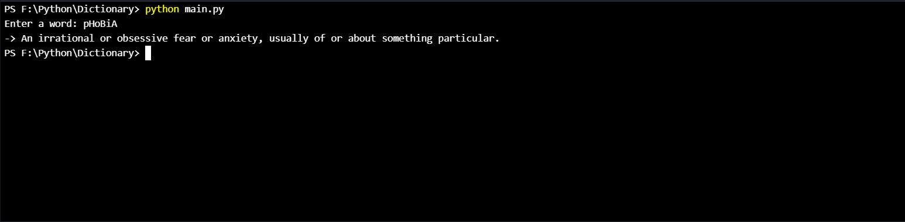
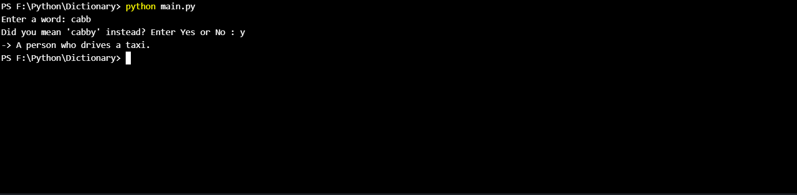
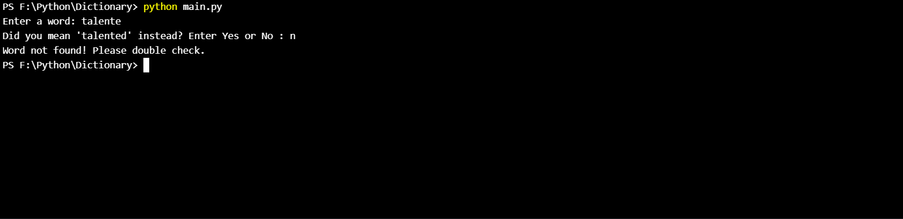
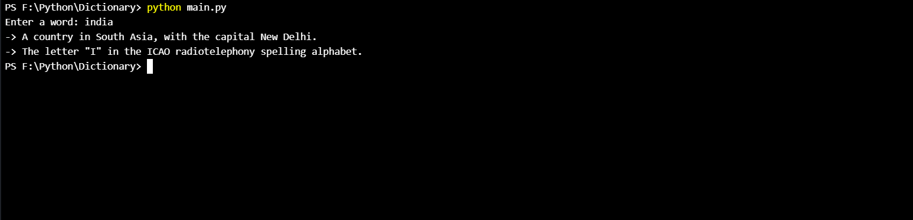
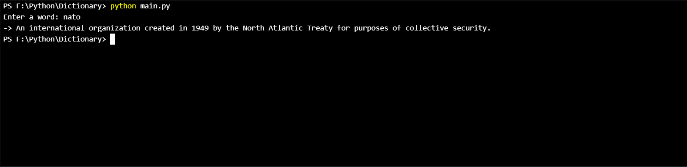

# Smart_Dictionary_Python

After execting the code, experiment with different inputs
-
->For example typing 'pHoBiA' will give you the correct output

->A closest match for a misspelled word would be suggested, as shown below

-> After suggesting a word, if the input of the user is a No. Then the output is

-> The first letter of a word is even captalized and checked. For example if the user enters 'india' the program converts it to 'India' and checks it in the dictionary as the first letter of nouns is to be captalized and are found in the same way in the dictionary. 

-> Similarly, all the letters of an abbrevation are changed to upper case before checking it in the dictionary.

